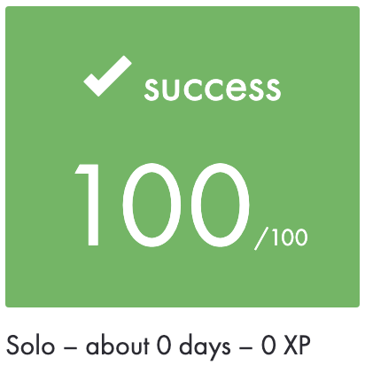
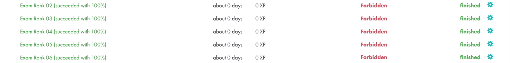

|          Grade         |                         |
|:----------------------:|:-----------------------:|
|  |  |

 

---

🇫🇷 FRENCH VERSION

## Préambule
Ce dépôt contient un aperçu de mes `examens` de l'école 42.

Chaque examen teste des compétences pratiques en programmation :
du développement bas-niveau en `C` à la programmation orientée objet en `C++`, jusqu'à la `programmation réseau`.

🛑 Attention : Ce dépôt ne contient pas de code ni de tickets d’examen — uniquement un README qui résume chaque épreuve.
L’objectif est de montrer quels examens j’ai passés et en quoi ils consistaient.

## Examens inclus
### Exam-Rank-02
- `Level 1–4` : Série de petits programmes en C, axés sur la `manipulation de chaînes`, `bits`, `math`, `gestion de fichiers`.
- L’objectif est de maîtriser les bases du C sans bibliothèques externes.

    

    
⬇ Détails Exam-Rank-02

    #### Niveau 1 – Bases du C
    - `ft_putchar`, `ft_putstr`, `ft_strlen`, `ft_strcpy`, `ft_swap`, `ft_strcmp`, etc.
    - Fonctions très simples sur les chaînes, les pointeurs et les entiers.
    - Introduction aux exercices plus complexes.

    #### Niveau 2 – Opérations bit-à-bit, arithmétique, chaînes
    - Exos comme `print_bits`, `reverse_bits`, `swap_bits`, `is_power_of_2`
    - Conversions de base (`ft_atoi`, `do_op`)
    - Manipulation de chaînes : `inter`, `union`, `wdmatch`, `last_word`, `camel_to_snake`, `snake_to_camel`

    #### Niveau 3 – Récursivité, pointeurs, structures
    - Arithmétique : `add_prime_sum`, `pgcd`, `lcm`
    - Récursivité : `ft_range`, `ft_rrange`
    - Chaînes : `expand_str`, `rstr_capitalizer`, `str_capitalizer`, `paramsum`
    - Listes et mémoire : `ft_list_size`, `ft_strrev`, `ft_strdup`, `ft_atoi_base`

    #### Niveau 4 – Algorithmes, mémoire, listes
    - Listes : `ft_list_foreach`, `ft_list_remove_if`, `sort_list`
    - Récursivité : `flood_fill`, `rev_wstr`
    - Tri et parsing : `sort_int_tab`, `rostring`
    - Chaînes et entiers : `ft_split`, `ft_itoa`, `print_hex`, `fprime`

    

### Exam-Rank-03
- `get_next_line` : Lecture ligne par ligne depuis un descripteur de fichier.
- `ft_printf` : Réimplémentation partielle de la fonction `printf`.

### Exam-Rank-04
- `microshell` : Mini shell capable de gérer `|` et `;`.

### Exam-Rank-05
- `cpp_module_00,01,02` : Création d’un petit système de magie en C++, avec `polymorphisme`, `clones`, gestion d'un **SpellBook**, **TargetGenerator**, etc.

### Exam-Rank-06
- `mini_serv` : **Serveur TCP** non-bloquant multiclient basé sur `select`, sans threads.

---

🇬🇧 ENGLISH VERSION

## Preamble
This repository contains an overview of my `exams` from 42 School.

Each exam tests hands-on programming skills:
from low-level `C` development to object-oriented `C++` and `network programming`.

🛑 Note: This repository does not include any source code or exam tickets — only a README that summarizes each exam.
The goal is to showcase what exams I took and what each one was about.

## Included Exams
### Exam-Rank-02
- `Level 1–4`: A series of small C programs focused on `string manipulation`, `bitwise logic`, `math`, and `basic file operations`.
- The goal is to master C fundamentals without external libraries.

    

    
⬇ More details Exam-Rank-02 

    #### Level 1 – C basics
    - `ft_putchar`, `ft_putstr`, `ft_strlen`, `ft_strcpy`, `ft_swap`, `ft_strcmp`, etc.
    - Simple functions for strings, pointers, and numbers.
    - A warm-up before diving into logic-heavy tasks.

    #### Level 2 – Bitwise operations, arithmetic, strings
    - Tasks like `print_bits`, `reverse_bits`, `swap_bits`, `is_power_of_2`
    - Basic conversions (`ft_atoi`, `do_op`)
    - String manipulation: `inter`, `union`, `wdmatch`, `last_word`, `camel_to_snake`, `snake_to_camel`

    #### Level 3 – Recursion, pointers, structures
    - Arithmetic: `add_prime_sum`, `pgcd`, `lcm`
    - Recursion: `ft_range`, `ft_rrange`
    - Strings: `expand_str`, `rstr_capitalizer`, `str_capitalizer`, `paramsum`
    - Lists and memory: `ft_list_size`, `ft_strrev`, `ft_strdup`, `ft_atoi_base`

    #### Level 4 – Algorithms, memory, lists
    - List operations: `ft_list_foreach`, `ft_list_remove_if`, `sort_list`
    - Recursion: `flood_fill`, `rev_wstr`
    - Sorting and parsing: `sort_int_tab`, `rostring`
    - Strings and numbers: `ft_split`, `ft_itoa`, `print_hex`, `fprime`

    

### Exam-Rank-03
- `get_next_line`: Read a file descriptor line by line.
- `ft_printf`: A partial reimplementation of the standard `printf`.

### Exam-Rank-04
- `microshell`: A mini shell that supports `|` and `;` parsing and execution.

### Exam-Rank-05
- `cpp_module_00,01,02`: A small magic system in C++ using `polymorphism`, `clone pattern`, **SpellBook**, and **TargetGenerator**.

### Exam-Rank-06
- `mini_serv`: A non-blocking multiclient **TCP server** using `select`, no threads.

---

🇷🇺 RUSSIAN VERSION

## Преамбула
Этот репозиторий содержит описание `экзаменов` из школы 42.

Каждый экзамен проверяет практические навыки программирования:
от низкоуровневой работы на языке `C` до объектно-ориентированного подхода на `C++` и `сетевого программирования`.

🛑 Внимание: В репозитории нет исходников или экзаменационных заданий — только README с обзором каждого экзамена.
Цель — ознакомить с тем, какие испытания я прошла и в чём заключалась суть каждого из них.

## Включённые экзамены
### Exam-Rank-02
- `Уровни 1–4`: Небольшие программы на C — `строки`, `биты`, `арифметика`, `ввод/вывод`.
- Цель — уверенно писать на C без сторонних библиотек.

    

    
⬇ Подробнее Exam-Rank-02 

    #### Уровень 1 – основы C
    - `ft_putchar`, `ft_putstr`, `ft_strlen`, `ft_strcpy`, `ft_swap`, `ft_strcmp`, и тд.
    - Простейшие функции работы со строками, указателями и числами.
    - Подготовка к более сложной логике.

    #### Уровень 2 – побитовые операции, арифметика, строки
    - Задания вроде `print_bits`, `reverse_bits`, `swap_bits`, `is_power_of_2`
    - Простые конверсии (`ft_atoi`, `do_op`)
    - Работа со строками: `inter`, `union`, `wdmatch`, `last_word`, `camel_to_snake`, `snake_to_camel`

    #### Уровень 3 – рекурсия, указатели, структура
    - Арифметика: `add_prime_sum`, `pgcd`, `lcm`
    - Рекурсия: `ft_range`, `ft_rrange`
    - Строки: `expand_str`, `rstr_capitalizer`, `str_capitalizer`, `paramsum`
    - Работа со списками: `ft_list_size`, `ft_strrev`, `ft_strdup`, `ft_atoi_base`

    #### Уровень 4 – алгоритмы, работа с памятью, списки
    - Работа со списками: `ft_list_foreach`, `ft_list_remove_if`, `sort_list`
    - Рекурсия: `flood_fill`, `rev_wstr`
    - Сортировка и парсинг: `sort_int_tab`, `rostring`
    - Работа со строками и числами: `ft_split`, `ft_itoa`, `print_hex`, `fprime`

    

### Exam-Rank-03
- `get_next_line`: Построчное чтение из файлового дескриптора.
- `ft_printf`: Частичная реализация стандартного `printf`.

### Exam-Rank-04
- `microshell`: Мини-шелл, поддерживающий пайпы `|` и команды через `;`.

### Exam-Rank-05
- `cpp_module_00,01,02`: Магическая система на C++ — с `полиморфизмом`, `клонированием`, **SpellBook** и **TargetGenerator**.

### Exam-Rank-06
- `mini_serv`: Асинхронный **TCP сервер** на `select`, без потоков.

---

## Exam Summary

| Exam Rank     | Level(s)        | Topics                            |
|---------------|-----------------|-----------------------------------|
| Exam-Rank-02  | Level 1–4       | Strings, bits, basic math, C      |
| Exam-Rank-03  | GNL / ft_printf | Line reading, formatted output    |
| Exam-Rank-04  | microshell      | Shell, parsing, file descriptors  |
| Exam-Rank-05  | C++ Modules 0–2 | OOP, Polymorphism, Spell system   |
| Exam-Rank-06  | mini_serv       | Non-blocking server with select   |
